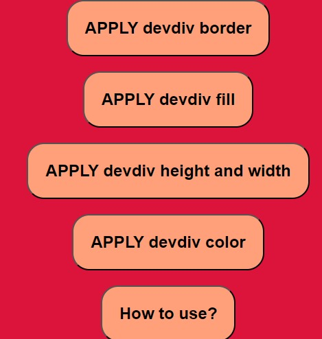

# DevDiv Browser Extension

The DevDiv browser extension is designed to enhance the web development experience, especially for beginners who have just learned HTML and CSS and want to improve their skills by cloning websites. This extension offers various tools and features to simplify web development tasks and analysis.
devDiv

## Features

### 1. Predicting Website Structure

Understanding the structure of a website can be challenging for beginners. DevDiv assists in this process by providing tools that help users analyze and dissect the layout and organization of websites they want to clone. This can include features like outlining the HTML structure, identifying key elements, and visualizing the page's layout.

### 2. Streamlined Inspection

DevDiv simplifies the process of inspecting and analyzing web elements. Instead of repeatedly using the browser's built-in inspection tools, the extension offers a more efficient and user-friendly way to examine web elements. This saves time and makes the development process smoother.

### 3. Color Scheme Assistance

Identifying different colored elements on a webpage is crucial for web design and development. DevDiv provides various color schemes and highlights elements with different colors, making it easier for users to distinguish between various page components. This feature is especially helpful when working on websites with complex designs.

### 4. How-to Guides

To ensure users get the most out of the extension, DevDiv includes detailed "how-to use" pages or guides. These guides walk users through the functionalities of the extension, explaining step by step how to utilize its features effectively. This helps users maximize their productivity and achieve their development goals.

## Usage

Once installed, you can access the DevDiv extension from your browser's toolbar. Follow the on-screen instructions and refer to the provided how-to guides to make the most of its features.

## Acknowledgments

DevDiv is built to simplify web development for beginners and enthusiasts. I would like to acknowledge the web development community for their continuous support and inspiration.

For more details and to explore the extension's features, visit our website: [DevDiv Extension Website](https://devdiv-web.netlify.app/)

Happy coding!
